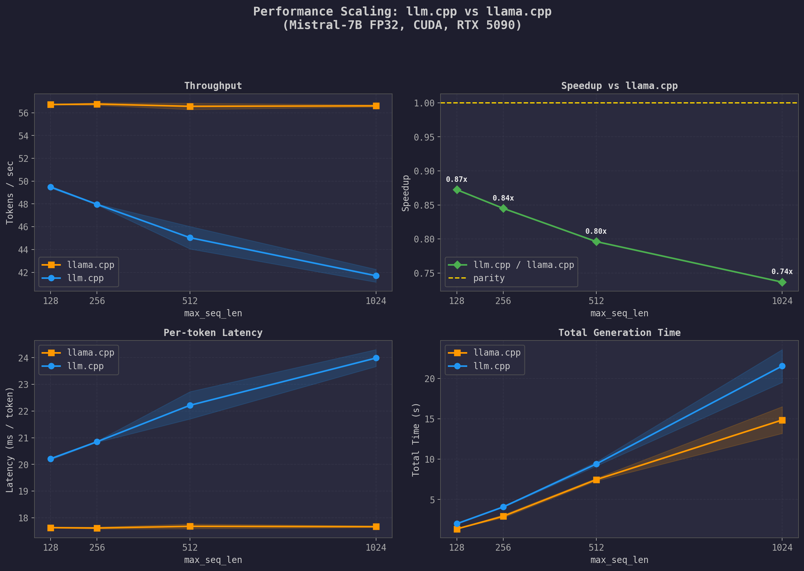

# llm.cpp

A from-scratch LLM inference engine in raw C++/CUDA for Mistral-v0.2 architecture with optimized, handwritten GPU kernels.

## Overview

llm.cpp runs autoregressive inference on the **Mistral-7B-Instruct-v0.2** model on CPU (with OpenMP + AVX2/F16C) and on NVIDIA GPUs (with custom CUDA kernels). The entire forward pass - embedding lookup, RMSNorm, QKV projections, RoPE, grouped-query attention with KV caching, SiLU-gated FFN, and logit projection - is implemented from scratch with no dependencies on cuBLAS, cuDNN or any ML framework at runtime.

**Key numbers** (NVIDIA RTX 5090, Mistral-7B FP32):

| Engine | Tok/s (seq_len=128) | Tok/s (seq_len=1024) | Latency (ms/tok) |
|--------|---------------------|----------------------|-------------------|
| **llm.cpp** (CUDA FP32) | **~50** | **~42**              | 20–24 |
| llama.cpp (CUDA FP32) | ~57 | ~57                  | ~17.7 |

llm.cpp achieves **74–88%** of llama.cpp's throughput depending on context length - with hand-written kernels, no cuBLAS/cuDNN. See [Evaluation](#evaluation) for full results.

## Architecture

```
┌──────────────────────────────────────────────────────┐
│                      main.cpp                         │
│  parseArgs → DataUtils → Config, Tokenizer, RunState │
└────────────────────────┬─────────────────────────────┘
                         │
                ┌────────▼────────┐
                │   Dispatcher    │   compile-time backend/dtype dispatch
                │  (CPU | GPU)    │
                │  (FP32 | FP16)  │
                └────────┬────────┘
                         │
           ┌─────────────┼─────────────┐
           ▼                           ▼
   ┌───────────────┐          ┌────────────────┐
   │ CPUInference  │          │ GPUInference   │
   │ OpenMP + AVX2 │          │ Custom CUDA    │
   └───────┬───────┘          └────────┬───────┘
           │                           │
           └──────────┬────────────────┘
                      ▼
              ┌───────────────┐
              │ InferenceLoop │   token-by-token generation
              │   + Sampler   │   temperature sampling
              └───────────────┘
```

### Forward Pass (per token)

For each transformer layer (×32 for Mistral-7B):

1. **RMSNorm** on the residual stream
2. **Fused QKV projection** - single kernel computes Q, K, V matmuls simultaneously
3. **Rotary Position Embedding (RoPE)** with θ=1,000,000
4. **KV cache update** - append K, V to the per-layer cache
5. **Grouped-Query Attention** - 32 query heads, 8 KV heads (4:1 GQA ratio)
   - Q·K^T scores → softmax → weighted V mix
6. **Output projection + residual** - fused matmul with residual add
7. **RMSNorm** on the residual stream (for FFN)
8. **Fused SiLU-gated FFN** - single kernel computes gate (W1) and up (W3) projections, applies SiLU, element-wise multiply
9. **Down projection + residual** - fused matmul with residual add

Final: RMSNorm → logit projection → temperature sampling

### Model Format

A custom binary format with a JSON metadata header followed by concatenated weight tensors:

```
[8 bytes]           Header size (uint64_t)
[header_size]       JSON metadata (__metadata__ with arch, dim, n_layers, ...)
[weights...]        Tensor data (FP32 or FP16)
[tokenizer.tokens]  Null-terminated UTF-8 vocabulary
```

Conversion from HuggingFace safetensors via `convert.py`, which handles the QK permutation reversal that HuggingFace applies.

## CUDA Kernels

All kernels in `src/cu.cu` are FP32, using 512 threads/block (16 warps × 32 threads). Key design choices:

### GEMV Kernels

Two variants depending on matrix shape:

- **`matmul_kernel_fp32`** - for tall matrices (n > d, e.g. hidden_dim × dim): each warp handles one output row, using `float4` vectorized loads for 4× memory throughput, with warp-level `__shfl_down_sync` reductions.
- **`matmul_kernel_fp32_hidim`** - for matrices with very large inner dimensions where a single warp cannot saturate the memory bus: entire block cooperates on one row, with two-level reduction (warp → block via shared memory).

### Fused Kernels

Kernel fusion was the primary optimization strategy, reducing global memory round-trips:

| Kernel | What It Fuses | Memory Savings |
|--------|---------------|----------------|
| `fused_qkv_matmuls_kernel_fp32` | Q, K, V projections into one kernel | Reads input `x` once instead of 3× |
| `fused_matmul_kernel_add_residual_fp32` | Matmul + residual connection | Eliminates intermediate buffer write/read |
| `fused_ff1ff3matmul_silu_kernel_fp32` | Gate (W1) + Up (W3) projections + SiLU activation + element-wise multiply | Reads input once, applies activation in registers |

### Attention Kernels

The attention computation is split into three kernels for clarity and to allow tuning shared memory usage independently:

1. **`attention_qk_kernel_fp32`** - computes Q·K^T scores with `atomicAdd` reduction across threads, scaled by 1/√d_head
2. **`softmax_kernel_fp32`** - numerically stable softmax with block-level max reduction followed by block-level sum reduction
3. **`attention_vmix_kernel_fp32`** - weighted value mixing: att × V with reduction across the sequence dimension

All attention kernels are GQA-aware: they compute the group index `g = head_id / group_size` to map multiple query heads to the same KV head.

### Other Kernels

- **`rmsnorm_kernel_fp32`** - two-pass: (1) block reduction for mean-square, (2) element-wise scale with `rsqrtf`
- **`rope_kernel`** - per-pair rotation using `__sincosf` for fast sin/cos
- **`silu_kernel`** / **`residual_kernel`** - element-wise operations

## Profiling with NVIDIA Nsight Compute

### Profiling Methodology

Profiling was done with `ncu` (Nsight Compute CLI) targeting individual kernel launches:

```bash
# Profile a specific kernel
ncu --set full --target-processes all -o nsight/report ./build/llm_cpp model.bin "Hello world!" 0.7 cuda

# Profile with kernel filtering
ncu --kernel-name matmul_kernel_fp32 --launch-count 5 -o nsight/matmul ./build/llm_cpp model.bin "Hello world!" 0.7 cuda
```

### Optimization Progression (guided by Nsight Compute)

Each commit on `feature/cuda-gpu-fp32` represents an optimization step informed by profiling:

| Phase | Commit | What Nsight Showed                           | What Changed                                                   |
|-------|--------|----------------------------------------------|----------------------------------------------------------------|
| 1 | `457d7d4` | Working baseline                             | Naive CUDA FP32 implementation                                 |
| 2 | `215048a` | GEMV memory-bound, low bandwidth utilization | Warp-level reductions                                          |
| 3 | `f1bee9f` | Excessive global memory reads in GEMV        | Shared memory utilization                                      |
| 4 | `45b42e2` | Instruction overhead from scalar loads       | `float4` vectorized loads across GEMV                          |
| 5 | `59265e2` | RMSNorm bottleneck, poor occupancy           | Optimized RMSNorm kernel + second GEMV variant for lower-dim matrices |
| 6 | `9f05894` | Excessive global memory traffic in FFN       | Fused matmul+residual, fused FF1+FF3+SiLU kernels              |
| 7 | `b6d86c5` | 3× redundant input reads in QKV projection   | Fused QKV matmul kernel                                        |
| 8 | `63135fd` | Attention kernel register pressure           | Attention kernel restructuring                                 |


### Using Nsight Systems for End-to-End Profiling

For system-level timeline profiling (CPU-GPU interaction, kernel launch overhead, memcpy overlap):

```bash
nsys profile --trace=cuda,osrt --output=nsight/timeline ./build/llm_cpp model.bin "Hello world!" 0.7 cuda
```

Nsight Systems timeline analysis revealed that GEMV (matmul) kernels dominate the end-to-end runtime - unsurprising for a 7B parameter model where each token requires multiple large matrix-vector products across 32 layers. This directed optimization effort toward the matmul kernels first, with attention and normalization kernels as secondary targets.

The timeline also showed that `cudaDeviceSynchronize()` after every kernel launch serializes the GPU pipeline, leaving gaps between kernel executions - a clear next optimization target via async kernel launches with CUDA streams.

## Evaluation

The `evaluate.py` script benchmarks llm.cpp against llama.cpp on Mistral-7B FP32 with CUDA, measuring how throughput scales with context length by running the same prompts at different `max_seq_len` values.

### Methodology

Both engines receive the same 3 long-form prompts (GPU architecture, transformer implementation, AI history) - prompts designed to always produce more tokens than the context cap allows. The `max_seq_len` parameter is swept across `[128, 256, 512, 1024]`. Each configuration is run 3 times after 1 warmup run, with results averaged.

For llm.cpp, `max_seq_len` is passed as a CLI argument that caps the KV cache and generation length. For llama.cpp, the equivalent is `-c <max_seq_len>` (context size). Both engines use temperature 0.7.


### Results



- **Top-left (Throughput):** llama.cpp holds flat at ~57 tok/s regardless of context length. llm.cpp starts at ~50 tok/s on short contexts and drops to ~42 tok/s at max_seq_len=1024 - the gap widens from ~12% to ~26%.
- **Top-right (Speedup):** llm.cpp runs at 0.85–0.88x of llama.cpp on short contexts, dropping to ~0.74x at 1024. The parity line (1.0x) is the target.
- **Bottom-left (Latency):** Mirror of throughput. llama.cpp stays at ~17.7 ms/tok. llm.cpp ranges from ~20 ms/tok (128) to ~24 ms/tok (1024).
- **Bottom-right (Total Time):** At max_seq_len=1024, llm.cpp takes ~22s vs llama.cpp's ~16s.

#### Analysis

Achieving **74–88% of llama.cpp's throughput** with a from-scratch engine is a good result. llama.cpp is a mature project with years of optimization by hundreds of contributors, backed by the ggml tensor library, and featuring flash attention, CUDA graph execution, and async kernel scheduling.

llama.cpp's throughput stays flat across context lengths, while llm.cpp degrades. The GEMV matmuls that dominate runtime are O(d²) per token regardless of context length, but attention is O(seq_len) - as context grows, attention takes a larger share of total per-token time. llm.cpp's attention is split across 3 separate kernel launches (QK^T, softmax, V mix), each with launch overhead and a `cudaDeviceSynchronize()` barrier. llama.cpp mitigates this with flash decoding and async execution via CUDA graphs/streams. Both are targets on the [Roadmap](#roadmap).

## Build

### Requirements

- CMake >= 3.20
- CUDA Toolkit >= 12.6
- C++20 compiler (GCC 11+ or Clang 14+)
- OpenMP

### Build Instructions

```bash
mkdir build && cd build
cmake .. -DCMAKE_BUILD_TYPE=Release
cmake --build . -j$(nproc)
```

### Python Dependencies

```bash
conda create -n llmcpp python=3.11
conda activate llmcpp
pip install -r requirements.txt
```

### Model Download

Download Mistral-7B-Instruct-v0.2 weights from HuggingFace:

```bash
huggingface-cli login
python download_model.py
```

### Model Conversion

Convert the downloaded weights to the custom binary format:

```bash
# FP32 (28.9 GB)
python convert.py model.bin mistral/ --dtype fp32

# FP16 (14.5 GB)
python convert.py modelfp16.bin mistral/ --dtype fp16
```

## Usage

```bash
./build/llm_cpp <model_path> <prompt> <temperature> <backend> [max_seq_len]
```

**Arguments:**

| Argument | Description | Values |
|----------|-------------|--------|
| `model_path` | Path to `.bin` model file | String |
| `prompt` | Input text | Any string |
| `temperature` | Sampling temperature | `0.0` = greedy, `0.0–1.0` |
| `backend` | Compute backend | `cpu`, `cuda` |
| `max_seq_len` | (optional) Override max context length | Default: from model config |

**Examples:**

```bash
# GPU inference (FP32)
./build/llm_cpp model.bin "What is the capital of France?" 0.0 cuda

# GPU inference with capped context
./build/llm_cpp model.bin "Once upon a time" 0.7 cuda 1024

# CPU inference (FP16, with temperature)
./build/llm_cpp modelfp16.bin "Once upon a time" 0.8 cpu
```

**Output:**

Generated tokens stream in real-time, followed by metrics:
```
Generation time: 21.87 seconds
Tokens generated: 902
Tokens per second: 41.29 tok/s
Latency: 0.02422 s/tok
Bandwidth: 123.45 GB/s
```

## Project Structure

```
llm.cpp/
├── src/
│   ├── main.cpp               # Entry point, argument parsing, metrics
│   ├── CPUInference.cpp        # CPU forward pass (OpenMP + AVX2/F16C)
│   ├── GPUInference.cu         # GPU forward pass (custom CUDA)
│   ├── cu.cu                   # All CUDA kernel implementations
│   ├── utils.cpp               # Data loading (mmap), math ops, model parsing
│   ├── Tokenizer.cpp           # Trie-based BPE tokenizer
│   ├── RunState.cpp            # Runtime tensor allocation (CPU/GPU)
│   └── Sampler.cpp             # Temperature sampling
├── include/
│   ├── Config.hpp              # Model hyperparameters
│   ├── Inference.hpp           # IInference<T> abstract interface
│   ├── InferenceLoop.hpp       # Token generation loop
│   ├── Dispatcher.hpp          # Backend/dtype compile-time dispatch
│   ├── TransformerWeights.hpp  # Weight storage with GPU upload
│   ├── RunState.hpp            # Runtime state (x, q, k, v, caches, ...)
│   ├── Timer.hpp               # CPU (chrono) and GPU (cudaEvent) timers
│   ├── Sampler.hpp             # Sampling interface
│   ├── Tokenizer.hpp           # Tokenizer interface
│   ├── cu.cuh                  # CUDA kernel declarations
│   ├── utils.hpp               # Utility declarations
│   └── errorUtils.hpp          # CUDA_CHECK macro
├── external/nlohmann/          # JSON library (header-only)
├── convert.py                  # HuggingFace -> custom binary format converter
├── download_model.py           # HuggingFace model downloader
├── requirements.txt            # Python dependencies for model conversion
├── CMakeLists.txt              # Build configuration
```

## Roadmap

- **Flash decoding** - fused single-pass attention kernel for autoregressive decoding to reduce per-token attention overhead and flatten throughput across context lengths
- **Async kernel execution** - replace `cudaDeviceSynchronize()` with CUDA streams/graphs to overlap kernel execution and hide launch latency
- **Quantized KV cache** - store K/V in FP16 or INT8 to reduce VRAM usage and enable longer context windows
- **Paged attention** - memory-efficient attention for very long sequences without pre-allocating the full KV cache
- **Batched inference** - process multiple sequences in parallel
- **Multi-GPU support** - tensor parallelism across devices
- **Additional architectures** - generalize beyond Mistral (Llama, Gemma, etc.)